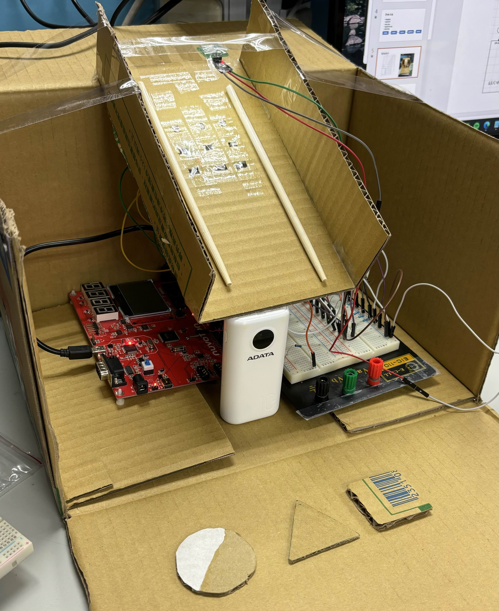
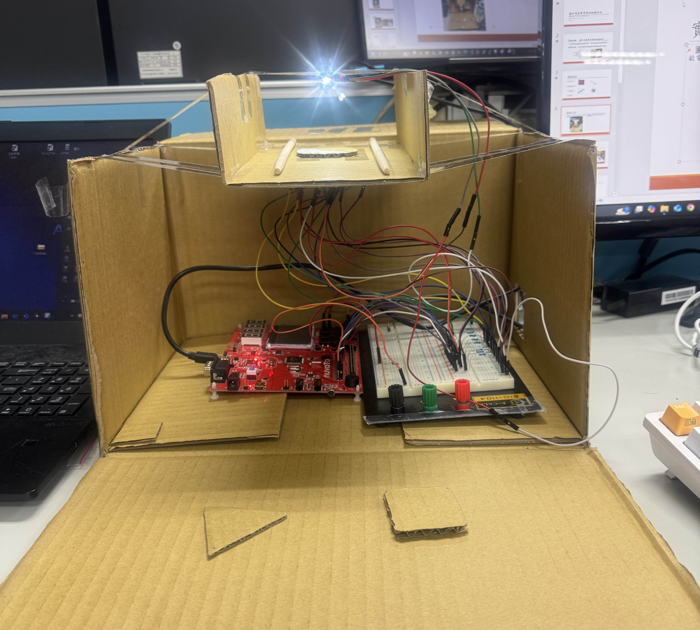

# 深度學習預測物體形狀 - 第七組期末專題

## 專題簡介
利用8個光敏電阻蒐集資料，利用這些資料進行深度學習的訓練，利用訓練好的模型對多種形狀進行分類

## 專題器材
- **NUC140 開發板**
- **光敏電阻** × 8
- **1kΩ電阻** × 8
- **光源燈**

## 系統架構
### 實驗器材

   
   

### 電路設計

### 模型結構
- **輸入層**：8個節點（8個光敏電阻的輸出）
- **隱藏層**：10個節點
- **輸出層**：4個節點（分別代表正方形、圓形、三角形、背景光）
- **訓練資料量**：260筆（正方形70筆、圓形70筆、三角形70筆、背景光50筆）

### 程式邏輯
1. **資料蒐集與處理**：
   - 利用光敏電阻蒐集不同形狀的數據，包含光強變化及方向資訊。
   - 標準化處理資料（計算均值與標準差）。
2. **深度學習模型訓練**：
   - 使用多層感知機（MLP）架構，進行訓練與測試。
   - 損失函數為均方誤差（MSE），學習率設定為0.01。
3. **即時預測**：
   - 根據光敏電阻的輸出，即時進行預測，並顯示物體形狀。

### 程式結構
- `main.c`：
  - `SYS_Init`：初始化系統時鐘與ADC模組。
  - `UART0_Init`：初始化UART模組。
  - `scale_data`：對資料進行標準化處理。
  - `data_setup`：蒐集並初始化訓練資料。
  - `run_train_data`：進行訓練資料的預測，檢驗模型精度。
  - `AdcSingleCycleScanModeTest`：即時獲取光敏電阻輸出並進行預測。

## 實驗流程
1. **環境架設**：
   - 將光敏電阻與NUC140開發板連接，並設置斜坡與光源。
2. **資料蒐集與標記**：
   - 收集260筆訓練數據，並標記為4種類別（正方形、圓形、三角形、背景光）。
3. **深度學習訓練**：
   - 訓練多層感知機模型，達到精度目標（95%以上）。
4. **即時預測**：
   - 使用光敏電阻實現即時形狀預測，輸出分類結果。

## 實驗成果
- 訓練精度達到**95%**以上。
- 成功分類正方形、圓形、三角形及背景光。
- 可即時預測物體形狀，並顯示於終端。
[第七組-基於深度學習預測物體形狀（斜坡版）](https://youtu.be/VYv-9fjrzEA?si=SW8husMmY-UB6VU7)
[第七組-基於深度學習預測物體形狀（平面版）](https://www.youtube.com/watch?v=C0VhJuB2X2U)

## 遇到的困難
- 光敏電阻輸出數值受外界光影響。
- NUC140 Flash容量限制了模型參數。
- 物體滑落時的旋轉與速度不穩定，影響數據蒐集準確性。

## 未來展望
- 使用更大Flash容量的開發板，存儲更多數據與模型參數。
- 在不同光環境下蒐集更多元數據。
- 採用更深層的神經網絡（例如RNN或LSTM）處理時間序列數據。
